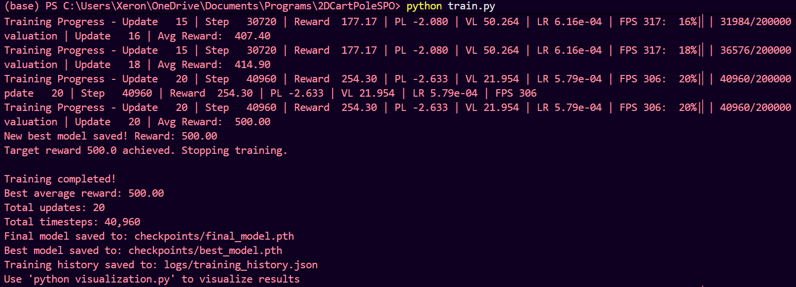
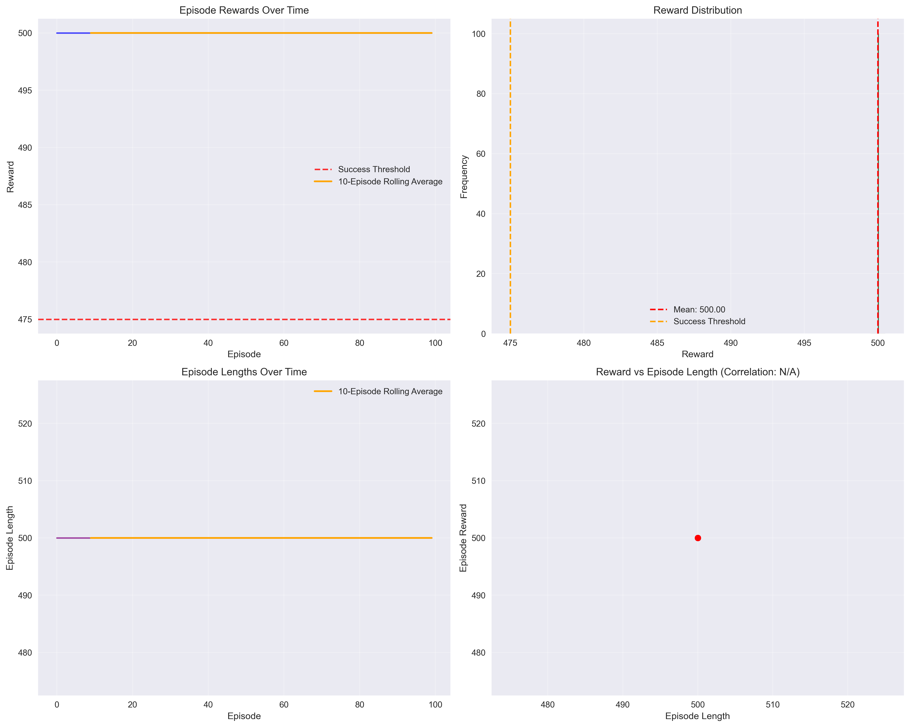
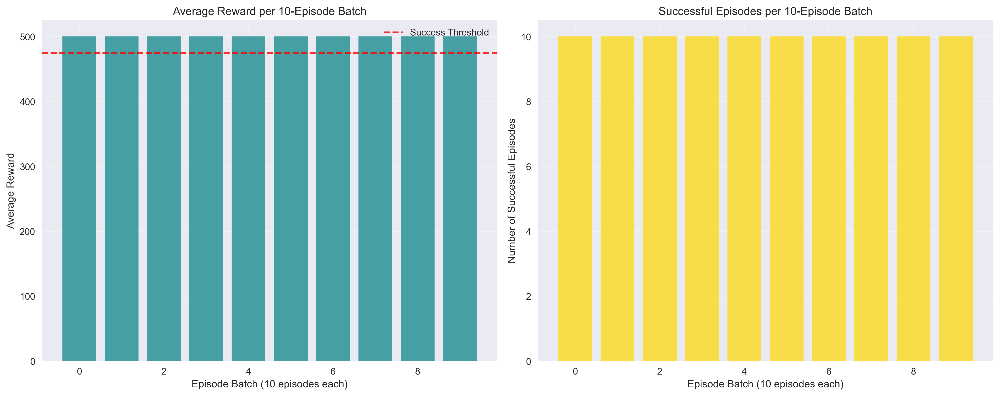
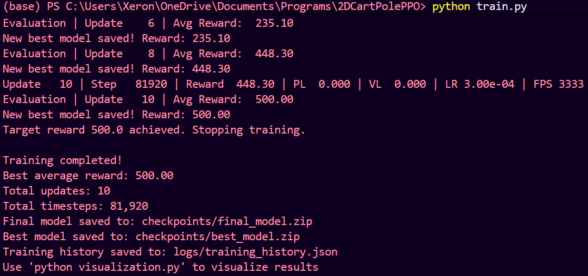
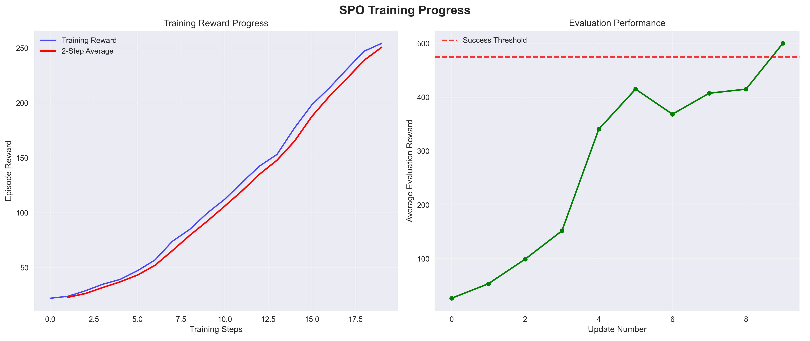
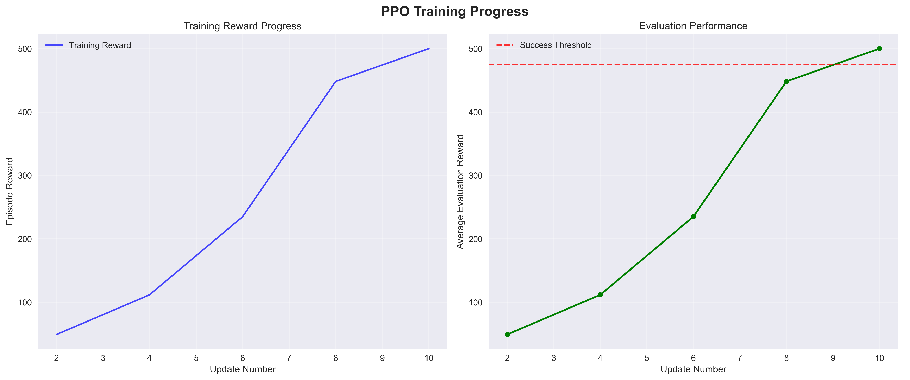
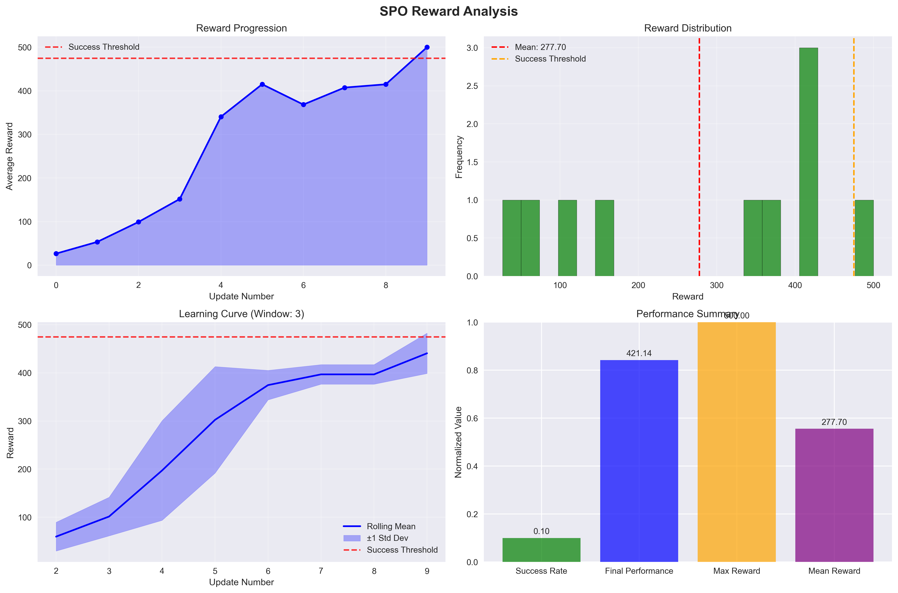
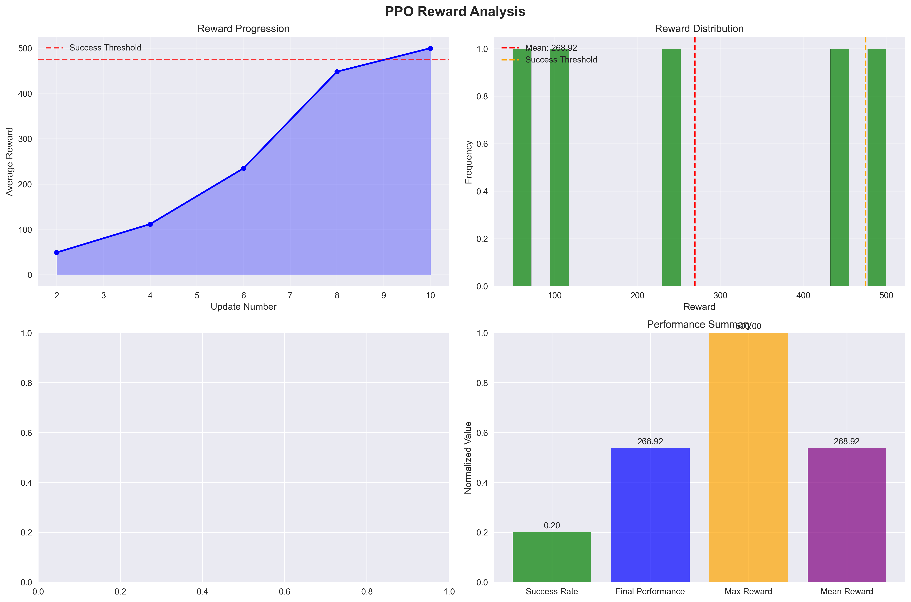
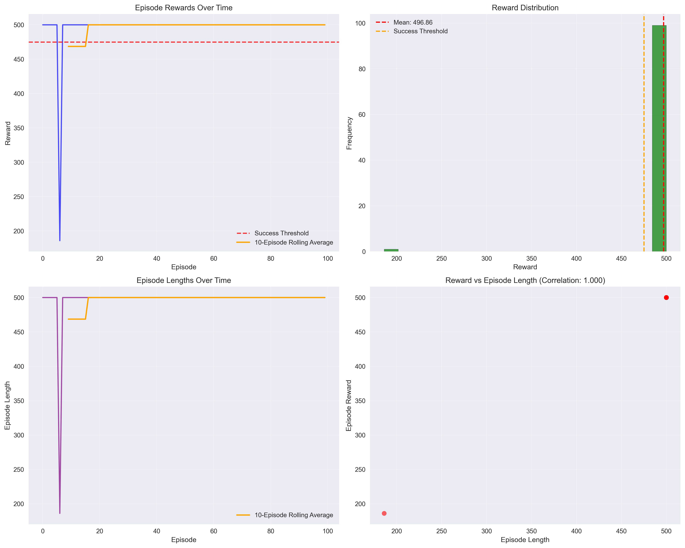
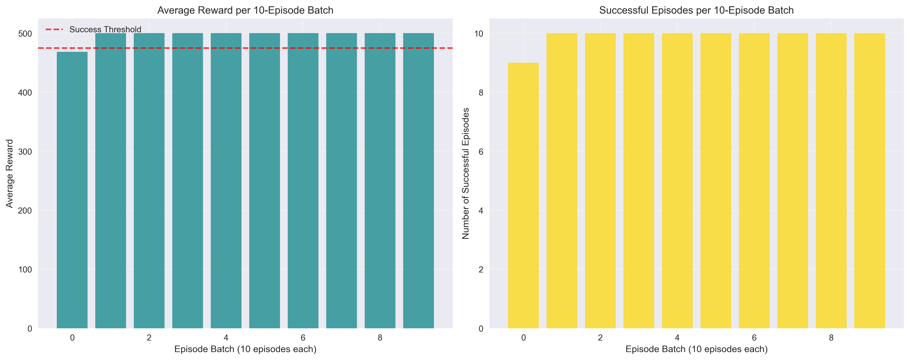

# Simple Policy Optimization (SPO) for CartPole‑v1:

## Abstract:
This project implements Simple Policy Optimization (SPO) in PyTorch for the Gymnasium CartPole‑v1 environment (discrete control). Using Optuna optimized hyperparameters and a centralized configuration, the SPO agent achieves perfect performance (average reward 500.0) rapidly and reproducibly. We compare SPO against a Stable‑Baselines3's PPO implementation on the same task and include full training/evaluation tooling and visuals.

---

## Introduction:
CartPole‑v1 is a classic control task with:
- Observation space: Box(4,) [cart position/velocity, pole angle/angular velocity].
- Action space: Discrete(2) [0: left, 1: right].
- Reward: +1 per time step, and max episode length 500 → max reward 500.
- “Solved” threshold: average reward ≥ 475.

SPO replaces PPO’s ratio clipping with a smooth quadratic penalty objective, which can provide better gradient flow and sample efficiency. This repository uses the SPOinPyTorch library and a centralized config system to ensure training and evaluation always share the exact same hyperparameters and network architecture.

---

## Results (for SPO) and Comparison (between SPO and PPO):

### SPO (this project):
- Optuna optimized architecture: 4×128 hidden units (actor/critic)
- Target reward: 500.0
- Evaluation frequency: every 2 updates
- Total updates: 20
- Total timesteps: 40,960
- Achieved 500.0 at Update 20 (40,960 timesteps)
- Progression: Update 16 → 407.40, Update 18 → 414.90, Update 20 → 500.00



### PPO (reference project):
- Implementation: Stable‑Baselines3 PPO (see [2DCartPolePPO](https://github.com/WhiteMetagross/2DCartPolePPO)).
- Reported progression: reaches 500.0 by the 10th update (81,920 timesteps)


PPO evaluation results (100 episodes):







### Comparison Summary:
| Algorithm | Final Avg Reward | Updates to 500 | Timesteps to 500 | Notes |
|---|---:|---:|---:|---|
| SPO (SPOinPyTorch) | 500.0 | 20 | 40,960 | Smooth penalty objective |
| PPO (SB3) | 500.0 | 10 | 81,920 | Clipped surrogate objective |

Both algorithms reach the maximum reward quickly. PPO attains 500.0 in fewer updates, and SPO matches the total sample count on this task and achieves the same peak performance.

---

## Cart Pole Problem's SPO and PPO RL Solution Comparison:

### 1) Training Progress Comparison:
- SPO training curves show rapid improvement in the late teen updates:
  - Update 15: reward ≈ 177.17 (PL −2.080, VL 50.264)
  - Update 16: eval avg ≈ 407.40
  - Update 18: eval avg ≈ 414.90
  - Update 20: best avg reward 500.00
- Convergence speed:
  - SPO reaches 500.0 at Update 20 with 40,960 total timesteps.
  - PPO reaches 500.0 by Update ~10 with ~81,920 total timesteps (per PPO logs).
- Stability/variance:
  - SPO: Steady rise with minor variance late, and losses trend downward (VL from ~50 → ~22 by Update 20), consistent with improved value estimates.
  - PPO: Training progress plots indicate a fast ascent and stabilization by 10 updates, and entropy typically decays as policy becomes deterministic.

SPO training information:


PPO training information:


Learning curve plots:

- SPO: 
- PPO: 

### 2) Reward Analysis Comparison:
- Progression and variance:
  - SPO: Reward trajectory increases smoothly into the 400s before saturating at 500, and variability tightens near convergence.
  - PPO: Similarly shows a rapid climb and tight concentration near 500 after convergence.
- Rolling averages/smoothness:
  - Both exhibit smooth rolling returns once past the initial exploration phase, and SPO’s rise occurs slightly later in updates but with fewer total samples.

Reward analysis plots:

- SPO: 
- PPO: 

### 3) Evaluation Performance Comparison:
- Distributions (rewards, episode lengths):
  - SPO: evaluation plots over 100 episodes concentrate at the performance ceiling (reward ≈500, episode length ≈500), indicating a robust, near-deterministic policy.
  - PPO: evaluation plots display similarly concentrated distributions near maximums.
- Robustness/consistency:
  - Both implementations achieve near-ceiling returns with narrow variance, suggesting stable final policies.

Evaluation plots:

- SPO: 
- SPO: 
- PPO: 
- PPO: 

### 4) Training Efficiency Comparison:
- Timesteps to convergence (higher is worse):
  - SPO: 40,960 timesteps (20 updates × 2,048 steps_per_batch)
  - PPO: 81,920 timesteps (10 updates × 1,024 n_steps × 8 envs)
- Updates to convergence:
  - SPO: 20 updates
  - PPO: 10 updates
- Interpretation:
  - SPO is more sample efficient on CartPole‑v1 (≈2× fewer env steps) while PPO converges in fewer optimization cycles. If wall clock cost is dominated by env interaction, SPO is advantageous, and if dominated by update compute, PPO may be competitive.

### 5) Algorithm Specific Observations:
- Objective:
  - SPO uses a smooth quadratic penalty around the importance ratio, encouraging stable yet informationrmative updates and potentially better gradient flow than hard clipping.
  - PPO uses ratio clipping to prevent large updates, which is simple and robust but may truncate useful gradients when far from the behavior policy.
- Hyperparameter sensitivity:
  - SPO’s epsilon and advantage scaling interact with optimization dynamics, and this repo’s Optuna optimized settings (like epsilon≈0.2995, 4×128 MLP) yielded fast, stable learning.
  - PPO’s clip_range and entropy scheduling influence exploration and stability, and SB3 defaults with tuned net_arch (2×128) performed strongly here.
- Practical takeaways for CartPole‑v1:
  - SPO: higher sample efficiency to the 500 ceiling with centralized config and auto‑synced evaluation.
  - PPO: fewer update rounds to converge with a mature, widely used implementation (SB3).

### Recommendations:
- If environment interaction is the bottleneck (like expensive simulators), prefer SPO for better sample efficiency.
- If you value minimal integration overhead or want a strong, standardized baseline, PPO (SB3) remains an excellent choice.
- For CartPole‑v1 specifically, both reach 500.0 reliably, and choose based on your compute profile ( compare env steps and optimizer time) and tooling preferences.


## Visualizations:
- SPO training progress and analysis (generated by this project):
  - 
  - 


- Evaluation outputs (100 episodes):
  - 
  - 

---

## Implementation Highlights:
- Discrete action handling: For vectorized envs, pass a 1D int array, and for single env evaluation, pass a Python int.
- Centralized configuration (config.py): Single source of truth used by both training and evaluation. The full config is also embedded inside each checkpoint for reproducibility.
- Optuna tuning (hyperparameter_optimization.py): Finds optimal SPO hyperparameters for CartPole‑v1, and pruning enabled through Optuna’s MedianPruner.

---

## Usage:

### Install SPOinPyTorch and project dependencies:
```bash
#If using the local SPOinPyTorch source.
python -m pip install -r requirements.txt
```

### Train (SPO):
```bash
python train.py
```
Behavior:
- Vectorized training with periodic evaluation (every 2 updates).
- Early stops when average evaluation reward ≥ 500.0
- Saves best and final checkpoints under `checkpoints/` with config embedded.
- Logs to `logs/` (JSON history and text log)

### Evaluate:
```bash
python evaluate.py
```
Behavior:
- Loads config from checkpoint when available to auto‑match architecture
- Runs 100 episodes and saves plots (`evaluation_plots.png`, `ppo_evaluation_analysis.png`)

### Visualize Training:
```bash
python visualization.py
```
Outputs:
- `spo_training_progress.png` and `spo_reward_analysis.png`

### Hyperparameter Optimization (Optuna):
```bash
python hyperparameter_optimization.py
```
Behavior:
- Runs trials with pruning, reports best params to `best_hyperparameters.json`

---

## Configurations (centralized):
All hyperparameters live in `config.py` through `get_default_config()` and include the current Optuna optimized values:
- actor_hidden_dims / critic_hidden_dims: [128, 128, 128, 128]
- steps_per_batch: 2048, update_epochs: 10, num_minibatches: 64
- learning_rate: 7.283e‑4, gamma: 0.99193779, gae_lambda: 0.95192001
- epsilon (SPO): 0.29947656, entropy_coeff: 0.00437818, value_loss_coeff: 0.50677
- max_grad_norm: 1.68414, normalize_advantages: False
- eval_interval: 2, target_reward: 500.0, early_stopping_patience: 20

The training code saves the full configirations dictionary inside each checkpoint. The evaluation code automatically loads and applies it.

---

## Project Structure:
```
2DCartPoleSPO/
├─ config.py                      #Centralized configuration (single source of truth).
├─ train.py                       #SPO training loop (SPOinPyTorch).
├─ evaluate.py                    #Evaluation with plots, and auto loads config from checkpoint.
├─ hyperparameter_optimization.py #Optuna tuning with pruning.
├─ visualization.py               #Training log parsing and plotting.
├─ checkpoints/                   #Saved models (with embedded configs).
├─ logs/                          #Training logs (JSON and text).
└─ visuals/                       #Static visuals referenced by README.
```

---

## References:
- SPO: Simple Policy Optimization (arXiv:2401.16025)
- PPO: Stable‑Baselines3 (Clipped Surrogate Objective)
- Gymnasium CartPole‑v1 environment

## Citation:
If you use this implementation or figures in your work, please cite the SPO paper and this repository.

- [The SPO Research Paper.](https://arxiv.org/abs/2401.16025)

- [The 2DCartPolePPO Repository.](https://github.com/WhiteMetagross/2DCartPolePPO)

- [The 2DCartPoleSPO Repository.](https://github.com/WhiteMetagross/2DCartPoleSPO)

- [The SPOinPyTorch Library.](https://github.com/RedZapdos123/SPOinPyTorch)

